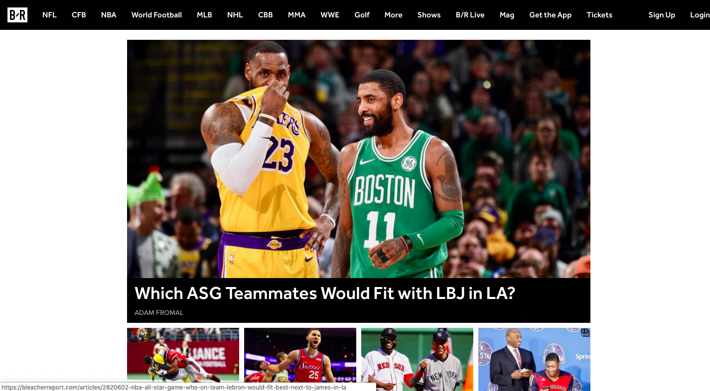
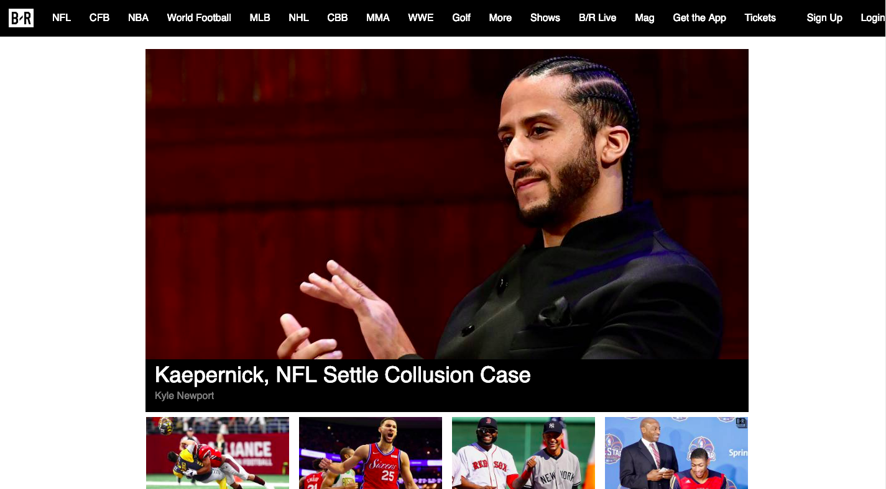

# Bleacher Report Clone

A clone of Bleacher Report's home page using HTML, CSS, and SASS.

## Getting Started

Clone from https://github.com/dinowins/bleacher-report-clone.git.
Open up in any browser of your choice.
Fork it to have your own copy.

## Description

Original website

Clone website

## Specs

Clone website's user interface is identical to original website.
Must have similar display and content layout.

## Authors
* **Dino Nguyen** - [Github](https://github.com/dinowins)

## License

This project is licensed under the MIT License - see the [LICENSE.md](LICENSE.md) file for details
